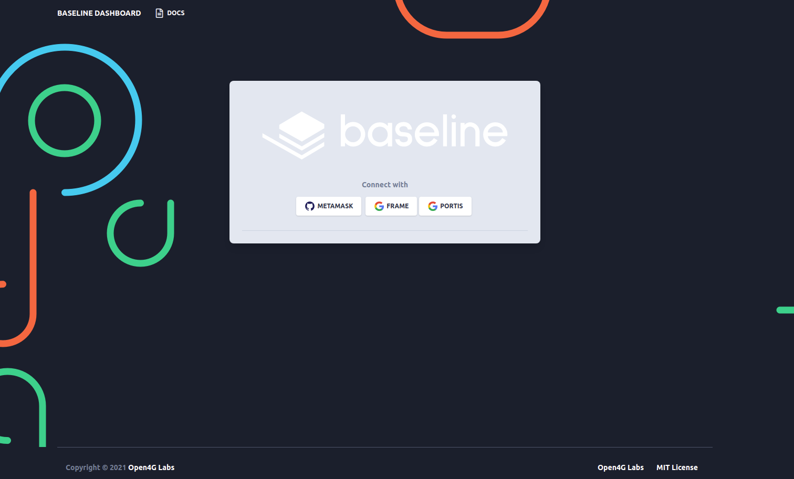
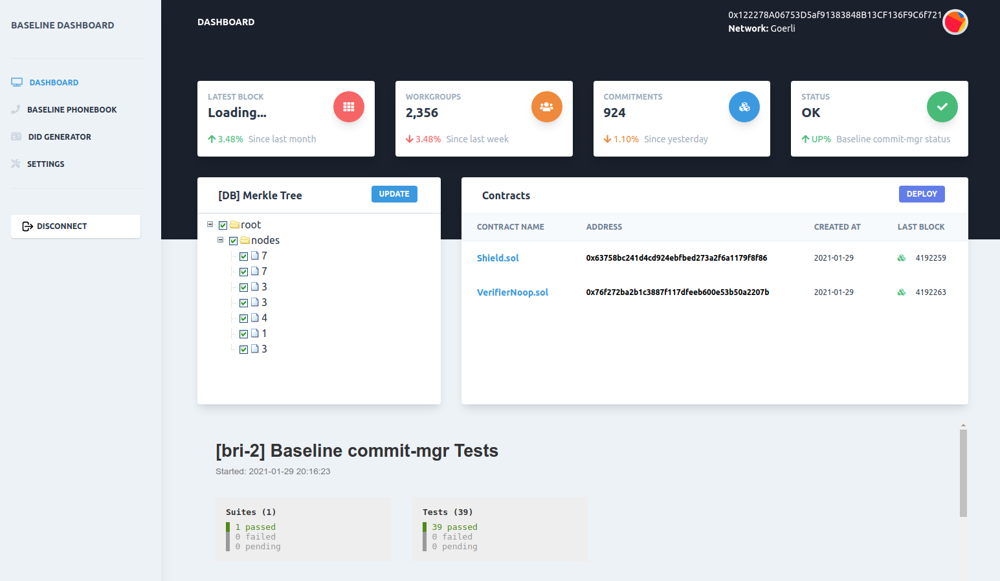
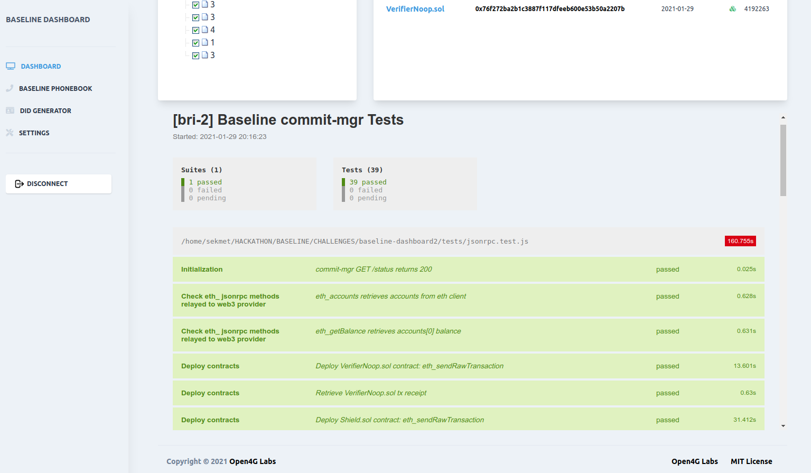
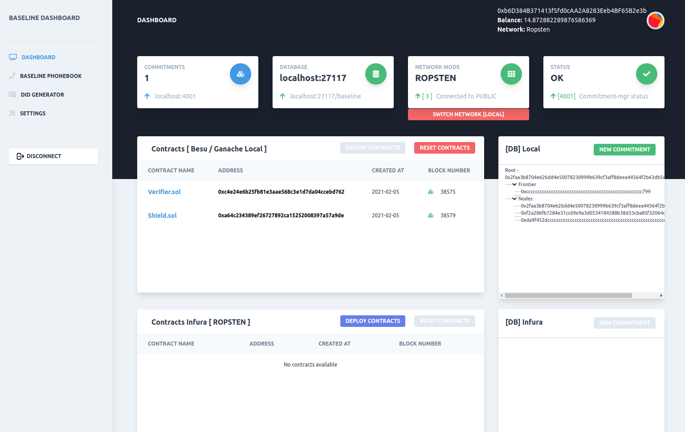
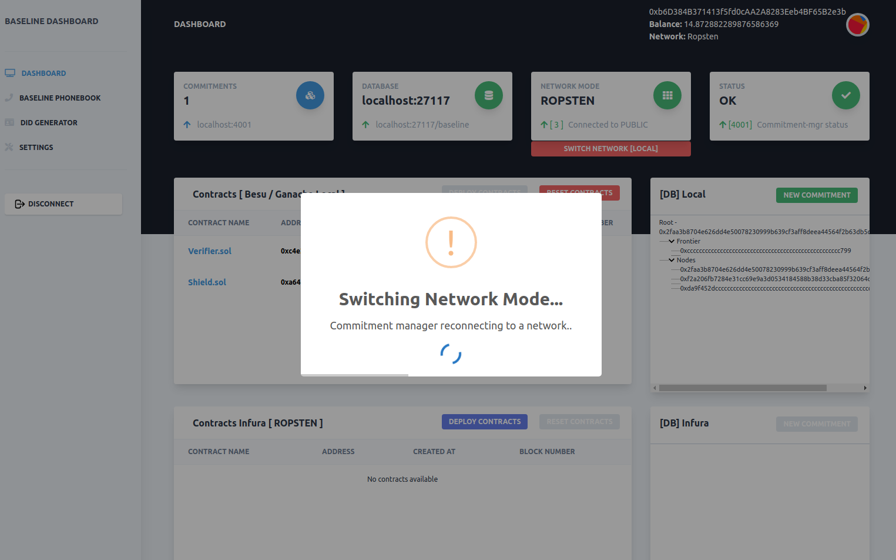
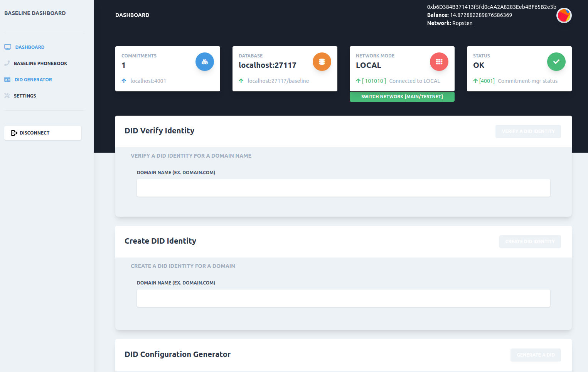
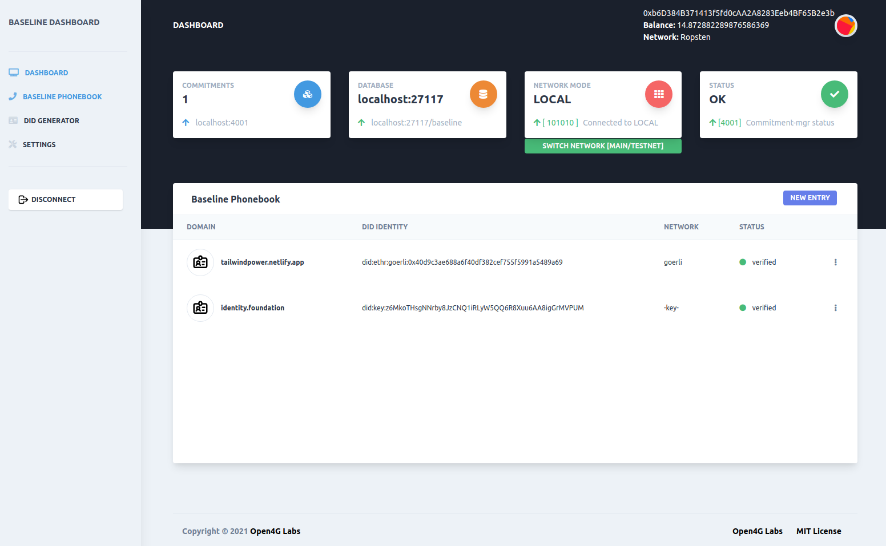
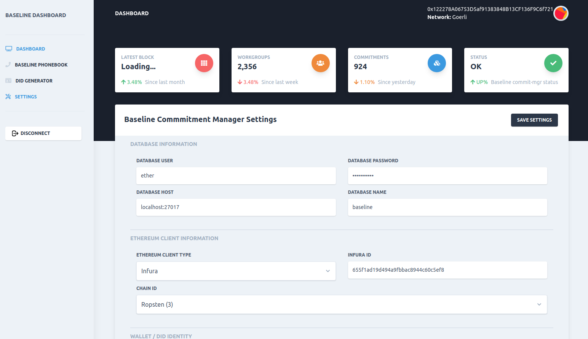

# Baseline-Chain-Dashboard

## Video Demo

## Requirements
- docker and docker-compose
- node / npm
- yarn
- metamask
- a infura account...

## Development

### Building
- npm install
- npm run build:all

### Running Development
- npm run dev

### Running Productive *alpha version
- npm run prod

### Contracts [GOERLI TEST NET]
[Shield.sol - 0x63758bc241d4cd924ebfbed273a2f6a1179f8f86](https://goerli.etherscan.io/address/0x63758bc241d4cd924ebfbed273a2f6a1179f8f86)

[VerifierNoop.sol - 0x76f272ba2b1c3887f117dfeeb600e53b50a2207b](https://goerli.etherscan.io/address/0x76f272ba2b1c3887f117dfeeb600e53b50a2207b)

# Screenshots

# Changelog

## Alpha Release [0.1.0] 2021-01-28
> [X] started project Baseline Chain Switcher Demo and Components

> [X] added UI Dashboard

## [0.1.1] 2021-01-29
> [X] added commit-mgr service tests report to dashboard

> [X] commit-mgr should be configurable via env vars such that it can use Infura as its web3 provider

> [ ] a repeatable test suite should be written to ensure baseline transactions can be submitted through Infura

> [X] Shield.sol and Verifier.sol contracts should be deployed on a public testnet/mainnet (verifiable via etherscan or similar)

> [X] root/leaves of on-chain merkle-tree in Shield contract should match root/leaves of off-chain tree stored in mongo

> [ ] commitments made in private Besu network should be replicated on public testnet/mainnet

### Bonus features:
> [X] add Well-Known DID configuration generator

> [X] add simple Baseline Phonebook UI

> [ ] use a faucet account or another way to fund public testnet/mainnet transactions so that judges can easily run test suite.

> [ ] find a way to securely+efficiently move what has already gone to the private Besu chain instance and move that to the public ethereum mainnet before commencing with new transactions.

> [ ] the verification circuit enforces some business logic (instead of using a no-op circuit)

> [X] add a UI that allows the user to configure the commit-mgr service